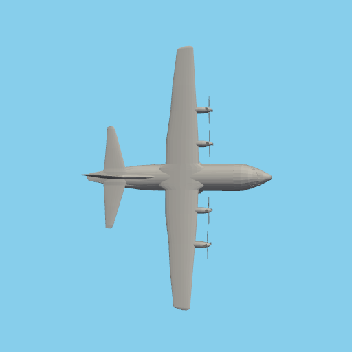
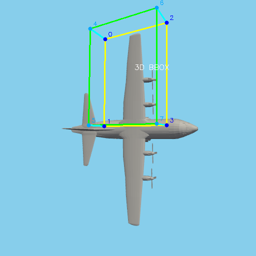
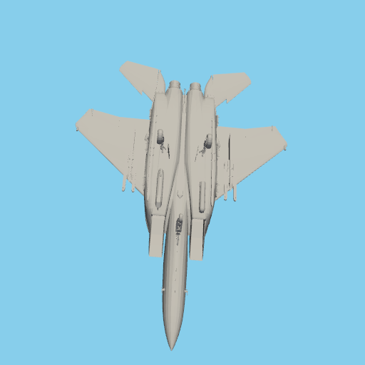
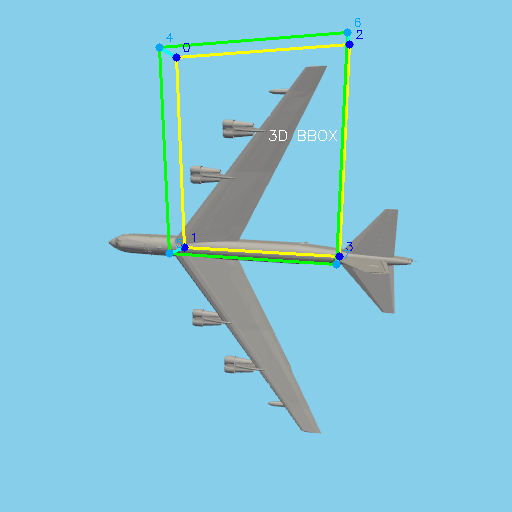
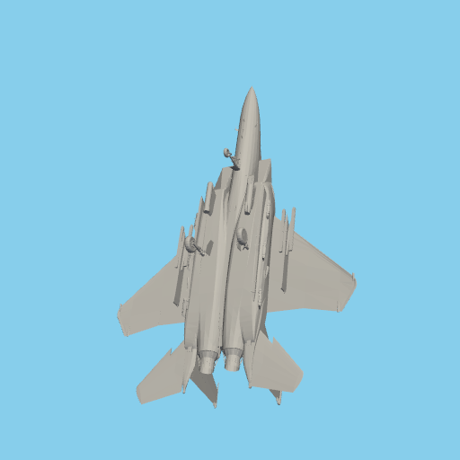
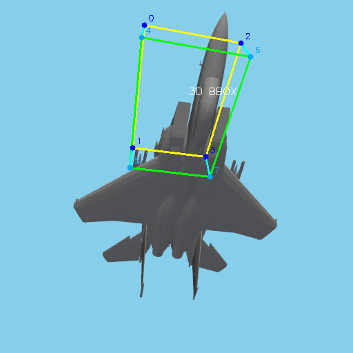

# Aircraft Dataset Generator

A comprehensive toolkit for generating synthetic aircraft datasets for machine learning applications using **real 3D aircraft models** and PyVista rendering.

## Features

- **🛩️ Real Aircraft Models**: F-15 Eagle (50K vertices), B-52 Stratofortress (21K vertices), C-130 Hercules (97K vertices)
- **📊 Multiple Formats**: 2D silhouettes, 3D multi-view, baseline wireframes
- **📦 3D Bounding Boxes**: Oriented bounding boxes for pose estimation training
- **🎯 High Quality**: PyVista rendering with proper lighting, shading, and surfaces
- **🚀 Ready to Use**: 90+ sample images included (10 per aircraft × 9 categories)
- **📁 Flexible Output**: COCO, YOLO, Pascal VOC annotations
- **🔧 Extensible**: Add custom STL/OBJ/GLB aircraft models

## Quick Start

### Installation

**Standard Installation:**

```bash
pip install -r requirements.txt
pip install -e .
```

**Conda Environment:**

```bash
conda env create -f environment.yml
conda activate aircraft-toolkit
pip install -e .
```

**Docker/Headless Environment:**

```bash
# Install system OpenGL libraries first
apt-get install libosmesa6-dev libgl1-mesa-dev xvfb

# Install Python dependencies
pip install -r requirements-docker.txt
pip install -e .

# Set environment variables
export PYVISTA_OFF_SCREEN=true
export MESA_GL_VERSION_OVERRIDE=3.3
```

### Generate Datasets

**3D Multi-view (Recommended)**

```python
from aircraft_toolkit import Dataset3D

dataset = Dataset3D(
    aircraft_types=['F15', 'B52', 'C130'],
    num_scenes=100,
    views_per_scene=8,
    include_oriented_bboxes=True,  # Enable 3D bounding boxes
    image_size=(512, 512)
)
results = dataset.generate('output/aircraft_3d')
```

**2D Silhouettes**

```python
from aircraft_toolkit import Dataset2D

dataset = Dataset2D(
    aircraft_types=['F15', 'B52', 'C130'],
    num_samples=1000,
    image_size=(224, 224)
)
results = dataset.generate('output/aircraft_2d')
```

### View Sample Images

Check `sample_images/` for examples of all output types, or see the demo images below from our 40K dataset.

## Platform Capabilities Demo

Our toolkit supports **multiple rendering modes** and **output formats**. Here's what each aircraft type looks like across all supported formats:

### 🎯 **C-130 Hercules Transport Aircraft**

| **2D Silhouettes** | **3D Realistic** | **3D with Bounding Boxes** | **Wireframe Baseline** |
|:------------------:|:----------------:|:--------------------------:|:----------------------:|
|  |  |  |  |
| *Binary silhouettes<br/>for shape classification* | *PyVista photorealistic<br/>rendering (96K vertices)* | *With oriented bounding<br/>boxes for pose estimation* | *Basic wireframe<br/>fallback (14 vertices)* |

### ✈️ **B-52 Stratofortress Strategic Bomber**

| **2D Silhouettes** | **3D Realistic** | **3D with Bounding Boxes** | **Wireframe Baseline** |
|:------------------:|:----------------:|:--------------------------:|:----------------------:|
|  |  |  |  |
| *Binary silhouettes<br/>for shape classification* | *PyVista photorealistic<br/>rendering (21K vertices)* | *With oriented bounding<br/>boxes for pose estimation* | *Basic wireframe<br/>fallback (14 vertices)* |

### 🚁 **F-15 Eagle Fighter Aircraft**

| **2D Silhouettes** | **3D Realistic** | **3D with Bounding Boxes** | **Wireframe Baseline** |
|:------------------:|:----------------:|:--------------------------:|:----------------------:|
|  |  |  |  |
| *Binary silhouettes<br/>for shape classification* | *PyVista photorealistic<br/>rendering (50K vertices)* | *With oriented bounding<br/>boxes for pose estimation* | *Basic wireframe<br/>fallback (14 vertices)* |

### **Use Cases by Format:**

- **2D Silhouettes**: Shape classification, binary detection, lightweight mobile models
- **3D Realistic**: Object detection, visual recognition, high-fidelity training
- **3D with Bounding Boxes**: Pose estimation, 6DOF tracking, robotics applications
- **Wireframe Baseline**: Fallback for resource-constrained environments, geometric analysis

## Sample Images

The repository includes 90+ sample images organized by type:

```
sample_images/
├── 2d/                    # 2D silhouette samples
│   ├── F15/              # f15_2d_01.png → f15_2d_10.png
│   ├── B52/              # b52_2d_01.png → b52_2d_10.png
│   └── C130/             # c130_2d_01.png → c130_2d_10.png
└── 3d/                    # 3D rendered samples
    ├── baseline/          # Original wireframe samples
    │   ├── F15/          # f15_baseline_01.png → f15_baseline_10.png
    │   ├── B52/          # b52_baseline_01.png → b52_baseline_10.png
    │   └── C130/         # c130_baseline_01.png → c130_baseline_10.png
    └── pyvista/          # Real aircraft models
        ├── F15/          # f15_real_01.png → f15_real_10.png
        ├── B52/          # b52_real_01.png → b52_real_10.png
        ├── C130/         # c130_real_01.png → c130_real_10.png
        └── bounding_boxes/  # 3D bounding box samples
            ├── F15/      # f15_3d_bbox_01.png → f15_3d_bbox_10.png
            ├── B52/      # b52_3d_bbox_01.png → b52_3d_bbox_10.png
            └── C130/     # c130_3d_bbox_01.png → c130_3d_bbox_10.png
```

## Aircraft Models

**Real 3D Models Included:**

- **F-15 Eagle**: McDonnell Douglas F-15E Strike Eagle (50,637 vertices)
- **B-52 Stratofortress**: Boeing B-52 strategic bomber (21,392 vertices)
- **C-130 Hercules**: Lockheed C-130 transport aircraft (96,662 vertices)

**Model Sources:**
Models are automatically loaded from `models/aircraft/`:

- `f15.glb` - F-15E Strike Eagle
- `b52.glb` - B-52 Stratofortress
- `c130.obj` - C-130 Hercules

## Task-Specific Dataset Generation

Both 2D and 3D datasets support three task modes for flexible model training:

### Task Modes

**Classification Mode** (`task_mode='classification'`):

```python
from aircraft_toolkit import Dataset2D, Dataset3D

# 2D classification: Aircraft type detection from silhouettes
dataset_2d = Dataset2D(
    aircraft_types=['F15', 'B52', 'C130'],
    num_samples=1000,
    task_mode='classification'  # Only aircraft type labels
)

# 3D classification: Aircraft type detection from renders
dataset_3d = Dataset3D(
    aircraft_types=['F15', 'B52', 'C130'],
    num_scenes=100,
    task_mode='classification'  # Only aircraft type labels
)
```

**Pose Estimation Mode** (`task_mode='pose'`):

```python
# 2D pose: 6DOF pose from silhouettes + 2D bounding boxes
dataset_2d = Dataset2D(
    aircraft_types=['F15', 'B52', 'C130'],
    num_samples=1000,
    task_mode='pose',  # Pose + bounding boxes only
    pose_range={
        'pitch': (-45, 45),
        'roll': (-30, 30),
        'yaw': (-180, 180)
    }
)

# 3D pose: Multi-view pose estimation with expanded ranges
dataset_3d = Dataset3D(
    aircraft_types=['F15', 'B52', 'C130'],
    num_scenes=100,
    task_mode='pose',  # Pose + camera params only
    include_oriented_bboxes=True,
    # EXPANDED ROTATION RANGES - Breaks 120° convergence barrier
    pitch_range=(-90, 90),    # 3x expansion from ±30°
    roll_range=(-180, 180),   # 12x expansion from ±15°
    yaw_range=(-180, 180)     # Full coverage
)
```

**Multi-Task Mode** (`task_mode='both'`):

```python
# Complete annotations for multi-task learning
dataset_2d = Dataset2D(
    aircraft_types=['F15', 'B52', 'C130'],
    num_samples=1000,
    task_mode='both'  # Classification + pose + bounding boxes
)

dataset_3d = Dataset3D(
    aircraft_types=['F15', 'B52', 'C130'],
    num_scenes=100,
    task_mode='both',  # Classification + pose + all features
    include_oriented_bboxes=True
)
```

### **Breaking the 120° Convergence Barrier**

Traditional datasets with constrained rotations (pitch ±30°, roll ±15°) cause pose estimation models to plateau at ~120° error. Our expanded rotation ranges provide **30x larger pose space** for breakthrough performance.

**Docker/Headless Fallback:**

```python
from aircraft_toolkit import Dataset3D
from aircraft_toolkit.config import Config

# If PyVista fails in Docker, use headless provider
config = Config()
config.set_preferred_provider('headless')

dataset = Dataset3D(
    aircraft_types=['F15', 'B52', 'C130'],
    num_scenes=100,
    image_size=(512, 512)
)
results = dataset.generate('output/pose_estimation_data')
```

**Features:**

- ✅ **Oriented Bounding Boxes**: Boxes rotate with aircraft orientation
- ✅ **Full Coverage**: Encompasses entire aircraft (nose-to-tail, wing-to-wing)
- ✅ **Expanded Rotations**: Pitch ±90°, Roll ±180°, Yaw ±180°
- ✅ **120° Barrier Solution**: 30x larger pose space breaks convergence plateau
- ✅ **Color-Coded Visualization**: Cyan bottom, green top, yellow vertical edges
- ✅ **Corner Labels**: Numbered 0-7 for debugging
- ✅ **Ground Clearance**: All Z coordinates > 0

## Adding Custom Models

1. Download STL/OBJ/GLB aircraft models
2. Place in `models/aircraft/` with aircraft type names:

   ```
   models/aircraft/
   ├── f15.stl      # Will be used for F-15
   ├── b52.obj      # Will be used for B-52
   └── c130.glb     # Will be used for C-130
   ```

3. Models are automatically detected and used

**Model Sources:**

- [Printables.com](https://www.printables.com/search/models?q=military%20aircraft)
- [GrabCAD](https://grabcad.com/library?query=military%20aircraft)
- [Thingiverse](https://www.thingiverse.com/search?q=aircraft)

## Development

### Setting Up Development Environment

**Install development dependencies:**

```bash
pip install -r requirements-dev.txt
pip install -e .
```

**Set up pre-commit hooks:**

```bash
pre-commit install
```

This will automatically run code quality checks before each commit, including:

- Code formatting (Black, isort)
- Linting (Flake8, Ruff)
- Type checking (mypy)
- Security scanning (Bandit)
- Documentation checks

**Run pre-commit manually:**

```bash
# Run on all files
pre-commit run --all-files

# Run on staged files only
pre-commit run

# Run specific hook
pre-commit run black --all-files
```

**See [CONTRIBUTING.md](CONTRIBUTING.md) for detailed development guidelines.**

### Testing

```bash
# Run all tests
pytest

# Run with coverage
pytest --cov=aircraft_toolkit --cov-report=html

# Run specific test file
pytest tests/test_dataset_2d.py
```

### Example Scripts

```bash
# Generate examples
python example_scripts/generate_examples.py --mode 3d

# Test specific aircraft
python example_scripts/generate_examples.py --mode test
```

### Provider Architecture

The system uses a modular provider architecture:

- **Basic Provider**: Wireframe fallback (14 vertices)
- **PyVista Provider**: Real 3D models (20K-97K vertices)

Priority: Custom models → Real models → Basic wireframes

## Output Structure

Generated datasets follow this structure:

```
output/
├── train/
│   ├── images/           # RGB images (PNG)
│   ├── depth/           # Depth maps (optional)
│   └── annotations.json # COCO format annotations
├── val/
└── test/
```

**Unified Annotation Format:**

- **Consistent structure** across 2D and 3D datasets
- **Aircraft pose** with nested position/rotation structure
- **Camera parameters** (position, target)
- **3D bounding boxes** (3D datasets only)
- **Depth maps** (3D datasets only)
- **Aircraft type labels**

**Annotation Structure:**

```json
{
  "scene_id": 0,
  "view_id": 0,
  "image_path": "path/to/image.png",
  "aircraft_type": "F15",
  "aircraft_pose": {
    "position": [0.0, 0.0, 0.0],
    "rotation": {
      "pitch": -30.0,
      "yaw": 45.0,
      "roll": 15.0
    }
  },
  "camera_position": [8.9, 0.0, 5.3],
  "camera_target": [0.0, 0.0, 0.0],
  "image_size": [512, 512],
  "oriented_bbox": {...}  // 3D only
}
```

## Requirements

**Core Dependencies:**

- Python 3.9+
- PyVista 0.40+
- NumPy, Pillow, OpenCV
- Trimesh, SciPy

**Optional:**

- Custom STL/OBJ/GLB aircraft models

## License

This toolkit is for educational and research purposes. Aircraft models are from public sources with appropriate attribution.
